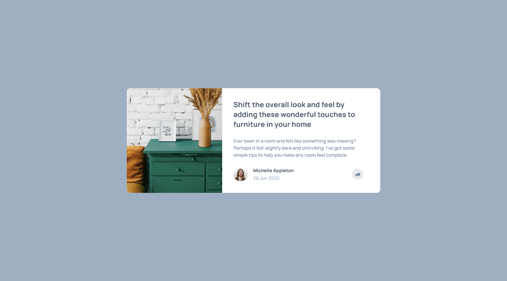

# Frontend Mentor - Article preview component solution

This is a solution to the [Article preview component challenge on Frontend Mentor](https://www.frontendmentor.io/challenges/article-preview-component-dYBN_pYFT). Frontend Mentor challenges help you improve your coding skills by building realistic projects. 

## Table of contents

- [Overview](#overview)
  - [The challenge](#the-challenge)
  - [Screenshot](#screenshot)
  - [Links](#links)
- [My process](#my-process)
  - [Built with](#built-with)
  - [What I learned](#what-i-learned)
  - [Continued development](#continued-development)
  - [Useful resources](#useful-resources)
- [Author](#author)

## Overview

### The challenge

Users should be able to:

- View the optimal layout for the component depending on their device's screen size
- See the social media share links when they click the share icon

### Screenshot

### Links

- Solution URL: [GitHub - GrzywN/article-preview-component-master](https://github.com/GrzywN/article-preview-component-master)
- Live Site URL: [Netlify](https://your-live-site-url.com)

## My process

### Built with

- Semantic HTML5 markup
- SCSS && CSS custom properties
- BEM
- Flexbox / CSS Grid
- Desktop-first workflow (because of complexity in layout)

### What I learned

I learned how to make popups in components like this one. 

## Author

- Frontend Mentor - [Frontend Mentor | GrzywN's profile](https://www.frontendmentor.io/profile/GrzywN)
- Twitter - [@GrzywN](https://twitter.com/grzywn)
